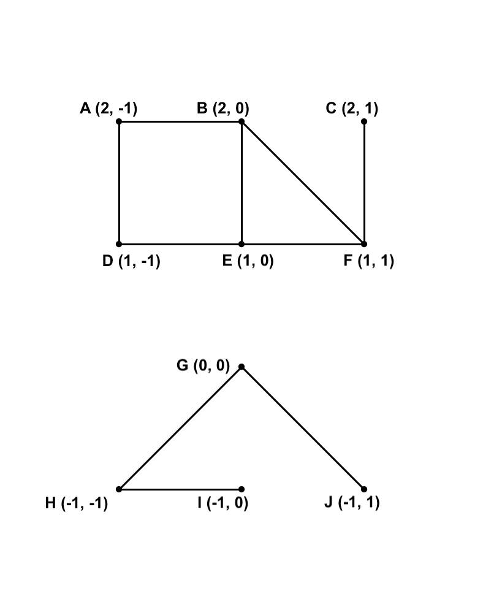
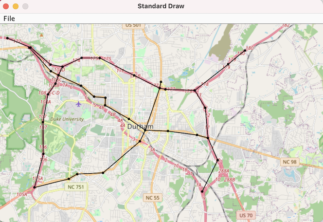

# Project 6: Route

This is the directions document for Project 6 Route in CompSci 201 at Duke University, Spring 2023. [This document details the workflow](https://coursework.cs.duke.edu/cs-201-spring-23/resources-201/-/blob/main/projectWorkflow.md) for downloading the starter code for the project, updating your code on coursework using Git, and ultimately submitting to Gradescope for autograding.

For this project, **you are allowed to work with a partner** (that is, in a group of two). If you are working with a partner, read the details in the expandable section below on how to collaborate effectively using Git. 

<details>
<summary>Details on Git with a Partner</summary>

You may find it helpful to begin by reading the Working Together section of the [Git tutorial](https://gitlab.oit.duke.edu/academic-technology/cct/-/tree/master/git) from the Duke Colab. For more, see the [Git tutoraial by Gitlab](https://docs.gitlab.com/ee/tutorials/make_your_first_git_commit.html) including the link to an [extensive video tutorial](https://www.youtube.com/watch?v=4lxvVj7wlZw) if you prefer that.

One person should fork the starter code and then add their partner as a collaborator on the project. Choose Settings>Members>Invite Members. Then use the autocomplete feature to invite your partner to the project as a *maintainer*. Both of you can now clone and push to this project. See the [gitlab documentation here](https://docs.gitlab.com/ee/user/project/members/).

Now you should be ready to clone the code to your local machines.

1. Both students should clone the same repository and import it into VS Code just like previous projects.  
2. After both students have cloned and imported, one person should make a change (you could just write a comment in the code, for example). Commit and push this change. 
3. The other partner will then issue a git pull request. Simply use the command-line (in the same project directory where you cloned the starter code for the project) and type:
```bash
git pull
```
4. If the other partner now opens the project in VS Code again, they should see the modified code with the edit created by the first partner. 
5. You can continue this workflow: Whenever one person finishes work on the project, they commit and push. Whenever anyone starts work on the project, they begin by downloading the current version from the shared online repository using a git pull command.

This process works as long as only one person is editing at a time, and **you always pull before editing** and remember to **commit/push when finished**. If you forget to pull before editing your local code, you might end up working from an old version of the code different than what is in the shared online gitlab repository. If that happens, you may experience an error when you attempt to push your code back to the shared online repository. 

There are many ways to resolve these conflicts, essentially you just need to pick which of the different versions of the code you want to go with. See the [working together Git tutorial](https://gitlab.oit.duke.edu/academic-technology/cct/-/blob/master/git/working_together.md) and the [branching and merging Git tutorial](https://gitlab.oit.duke.edu/academic-technology/cct/-/blob/master/git/branching_merging.md) from the Duke Colab for more information. You can also refer to our [Git troubleshooting document](https://coursework.cs.duke.edu/201-public-documentation/resources-201/-/blob/main/troubleshooting.md#git-faq). 

If you run into a merge conflict, one thing that might be confusing is that the editor that opens where you can resolve them may, by default, be [VIM](https://www.vim.org), which can be very unintuitive if you have not used it before. You can either look up the basics there, or if you prefer you can set a different text editor as the default that git uses for editing commit messages, merge conflicts, etc. For example, to make Visual Studio Code the default editor (this was an optional step we suggested during installation, so you may have already done this):
1. Open the command palette on visual studio code (`shift` + `command` + `p` on Mac, or `shift` + `ctrl` + `p` on Windows).
2. Write `Shell Command: Install 'Code' command in path` - it should autocomplete to this, press enter. It may ask for your permission.
3. In a terminal, enter the command `git config --global core.editor "code --wait"`. Now VS Code should be the default editor for git.
4. You can confirm the change by trying `git config --global -e` in a terminal. This should open a VS Code window showing your `git config` file (you don't need to edit, this is just to confirm it worked).

The `--wait` command means that whenever `git` opens something in VS Code for you to edit, it will wait until you close that window/tab before proceeding.


</details> 

## Outline 

- [Project Introduction](#project-introduction)
    - [The `Point` Class](#the-point-class)
    - [The `Visualize` Class](#the-visualize-class)
    - [Graph Data](#graph-data)
- [Part 1: Implementing `GraphProcessor`](#part-1-implementing-graphprocessor)
- [Part 2: Creating `GraphDemo`](#part-2-creating-graphdemo)
- [Submitting and Grading](#submitting-and-grading)

## Project Introduction

In this project you are asked to implement a routing service that represents the United States highway network as a graph and calculates routes and distances on this network. At a high level, in part 1 you will implement `GraphProcessor` which stores a graph representation and provides public methods to answer connectivity, distance, and pathfinding queries. This part of the project will be autograded as per usual. 

In part 2 you will implement a `main` method in `GraphProcessor` that produces a minimal viable product (also known as MVP) demonstrating the functionality of `GraphProcessor` and visualizing the results. For this part, you will record a brief demo of you or someone else *using* your program to find and visualize a route. [See this video](https://duke.hosted.panopto.com/Panopto/Pages/Viewer.aspx?id=d3f2cc7a-902a-499f-850b-af4e014f8a07) for an example of a completed `GraphDemo` at work. Your demo will be graded by TAs and counts for the analysis part of this project; there are no separate/additional analysis questions.

The rest of this section introduces you to the starter code, especially the `Point` and `Visualize` classes, as well as the graph data we will be using.

### The `Point` Class

You are provided in the starter code with `Point.java` that represents an immutable (meaning it cannot be changed after creation) point on the Earth's surface. Each such point consists of a [latitude](https://en.wikipedia.org/wiki/Latitude), or north-south angle relative to the equator, and a [longitude](https://en.wikipedia.org/wiki/Longitude), or east-west angle relative to the prime meridian. We use the convention whereby **latitudes and longitudes are both measured in degrees between -180.0 and 180.0**, where positive latitudes are for north of the equator and negative latitudes are for south of the equator. Similarly, positive longitudes are for east of the prime meridian, and negative longitudes are for west of the equator. 

Vertices/nodes in the graph we will use to represent the United States highway system will be `Point` objects. You should not need to do edit anything in the `Point` class. However, you may wish to use the various methods that are supplied for you. These methods are described in more detail in the expandable section below.

<details><summary>Expand for details on Point methods</summary>

- `getLat` and `getLon` are getter methods for returning the values of the private latitude and longitude instance variables. 
- The `distance` method calculates the "straight-line" distance in US miles from one point to another. Note that latitudes and longitudes are *angles* and not x-y coordinates, so this calculation requires trigonometric projection onto a sphere. This can get a little complicated, see [great circle distances](https://en.wikipedia.org/wiki/Great-circle_distance) if you're curious, but you do **not** need to understand or change this math. Please use the `distance` method provided and do not alter or implement a different one, for the sake of consistency with the autograder.
- The `equals` method checks if two points have the same `latitude` and `longitude`.
- The `hashCode` method has been implemented to be consistent with `equals`, and so that you can use `Point` objects in `HashSet`s or as keys in `HashMap`s.
- The `toString` allows you to directly print Point objects.
- The `compareTo` method compares `Point` objects by latitude, then breaks ties by longitude. Note that `Point implements Comparable<Point>`.

</details>

### The `Visualize` Class

One of the things you will be asked to do in your ultimate demo is create visualizations of the route(s) computed by your algorithms. To do this, you are provided with `Visualize.java` (which, in turn, uses `StdDraw.java`, though you won't need to directly call anything from this). You do not need to edit the `Visualize` class, though you will use it. The Visualize class is described in more detail in the expandable sectios below.

<details><summary>Expand for details on Visualize and methods</summary>

The constructor to create a `Visualize` object has two parameters. `visFile` should be a file in the `.vis` format:
```
min_longitude max_longitude
min_latitude max latitude
width height
```
where the ranges correspond to the left, right, bottom, and top boundaries respectively of the image onto which the graph will be visualized, and the width and height are the number of pixels in the image to be visualized. You are provided with 3 `.vis` files inside of the `data` folder, corresponding to the three images inside of the `images` folder.

`imageFile` should be a `.png` image with dimensions matching those supplied in the `visFile`. Three such images files are supplied inside of the `images` folder, each of which has a corresponding `.vis` file. These images were taken from [Open Street Map](https://www.openstreetmap.org) for purely educational purposes and are not approved for commercial applications.

The `public` methods of `Visualize` are:
- `drawPoint` draws a single point on the image supplied.
- `drawEdge` draws an edge between two points on the `image` supplied.
- `drawGraph` takes a `List<Point>` and calls `drawPoint` on each, as well as a `List<Point[]>`, and attempts to call `drawEdge` on the index 0 and index 1 elements of each array in the latter list.
- `drawRoute` takes a `List<Point>` and draws each point in the list, connecting each subsequent two points by an edge. **This is the method you are most likely to directly use in visualizing the route(s) you calculate.**

</details>

### Graph Data

A graph consists of a number of vertices/nodes and the connections between them (known as edges). Our data represents highway networks, where vertices/nodes are points (see the [`Point` class](#the-point-class)) on the Earth's surface and the edges represent road segments. Our graph is **undirected**, meaning we assume every edge can be traversed in either direction. Our graph is also **weighted**, meaning the edges are not all of the same length. **The weight of an edge is the straight-line distance between its endpoints**, see [the `Point` class](#the-point-class) for the `distance` method.

The data we work with was originally pulled from the [METAL project by Dr. James D. Teresco](https://courses.teresco.org/metal/graph-formats.shtml). This data is intended for educational use only and not for any commercial purposes. It has been slightly modified and stored as `.graph` files inside of the `data` folder. Three `.graph` files are supplied, the first two are small and intended for development, testing, and debugging, and the third is much larger and intended for use in the final demo. All three have corresponding `.vis` and `.png` files for use with `Visualize`.

1. `simple.graph` contains a small abstract graph (meaning not a real road network) with ten nodes and ten edges. A visualization is shown below at the left. We recommend using `simple.graph` while developing/debugging your project, as it is much easier to reason about and you don't need to worry much about efficiency.

2. `durham.graph` contains a small but real-world graph, a subset of `usa.graph` that lies within the downtown Durham area. A visualization is shown below at the right. Note that now the graph is imposed on a real image of the road network of Durham instead of an abstract background. We recommend testing on `durham.graph` after you feel comfortable that your code is working on `simple.graph`.

<div align="center">
  
  
</div>

3. `usa.graph` contains over 85 thousand vertices and edges representing the (continental) United States Highway Network. This is the network on which you will ultimately produce your demo, and for which the efficiency or not of your implementations may become noticeable.

The format of a `.graph` file is described in more detail in the expandable section below.

<details><summary>Expand for details on the `.graph` file format</summary>

Each `.graph` file represents a graph in the following format:

```
num_vertices num_edges
node0_name node0_latitude node0_longitude
node1_name node1_latitude node1_longitude
...
index_u_edge0 index_v_edge0 optional_edge0_name
index_v_edge1 index_v_edge1 optional_edge1_name
...
```
In other words:
- The first line consists of the number of vertices and edges respectively, space separated.
- The next `num_vertices` lines describe one vertex/node per line, giving its name/label, then its latitude, then its longitude, all space separated.
- The next `num_edges` lines describe one edge per line, giving the index of its first endpoint and then the index of its second endpoint, space separated. These indices refer to the order in which the vertices/nodes appear in this file (0-indexed). For example, `0 1` would mean there is an edge between the first and second vertices listed above in the file. 
- There may or may not be an edge label/name after the indices for each edge; `simple.graph` and `durham.graph` do not include these labels, but `usa.graph` does, so you will need to be able to handle both cases.

</details>

## Part 1: Implementing `GraphProcessor`

In this part you will implement `GraphProcessor`, which stores a graph representation and provides public methods to answer connectivity, distance, and pathfinding queries. This part of the project will be autograded. To pass autograder compilation, you must write your `GraphProcessor` implemention entirely within the provided `GraphProcessor.java` file. If you use helper classes, they should be included in the file as nested classes.

JUnit tests are also supplied to test your code locally, and we suggest starting by testing with the straightforward `TestSimpleGraphProcessor` for ease of debugging. Once you pass `TestSimpleGraphProcessor`, you can also check compliance with `TestUSGraphProcessor`, which runs on the same data as the autograder. However, **you will need to do the following before you can run JUnit tests** locally for this project (expand details below).

<details><summary>Expand for details on configuring VS Code for JUnit</summary>

VS Code, by default, runs JUnit tests in a *different* working directory than your project directory. This causes a problem for JUnit tests on this particular project because the JUnit tests need to call your `initialize` method which opens files using a relative path from the project directory (for example, `data/simple.graph`). The simplest way to fix this is to change the working directory for JUnit with VS Code, which you can do in the following steps.

1. Open your `settings.json` file in VS Code. To do this, open the command palette (`shift` + `command` + `p` on a Mac, or `shift` + `ctrl` + `p` on Windows) and type "settings.json". Select "Preferences: Open Workspace Settings (JSON)."
Edit your `java.test.config` in VS Code, or
2. Edit your `settings.json` to look like the following and then save:

```
{
    "java.test.config": {
        "workingDirectory": "${workspaceFolder}"
        }
}
```

That should be it!

</details>

The starter code for `GraphProcessor.java` includes five public methods you must implement. Each is described below and also in javadocs inside of the starter code. While these are the only methods you must implement, you are very much *encouraged to create additional helper methods* where convenient for keeping your code organized and to avoid repetitive code. As a rough rule of thumb, if you find yourself writing a method that is longer than fits on your text editor at once (maybe 20-30 lines), or if you find yourself copy/pasting many lines of code, you might consider abstracting some of that away into a helper method. You could even create additional classes to help you implement these methods if you so choose.

### Instance variables

You will need to add instance variables to your `GraphProcessor` to represent a graph, but exactly how to do this is left up to you. Remember that vertices/nodes in the graph should be `Point` objects, see [the `Point` class](#the-point-class). As a hint, your graph representation should allow you to efficiently do things like:
- Check if two vertices are adjacent (meaning there is an edge between them), or
- For a given vertex, lookup/loop over all of its adjacent vertices.  

### Implement `initialize`

This method takes as input a `FileInputStream`. This input stream should be for a file in the [`.graph` format](#graph-data). The method should read the data from the file and create a representation of the graph, **stored in the instance variables** so that the graph representation is avaialble to subsequent method calls. If the file cannot be opened or does not have the correct format, the method throws an `Exception`, for example:
```java
throw new Exception("Could not read .graph file");
```

You can see previous projects for examples of reading data from files, or you can see the `readVis` method in the `Visualize` class of the starter code. For example, you can create a `Scanner` to read from the input stream. See the documentation for the java [`Scanner` class here](https://docs.oracle.com/en/java/javase/17/docs/api/java.base/java/util/Scanner.html). Chapter 4 of the course Zybook also includes a section on file input. You might use the `hasNextDouble()`, `nextDouble()`, `hasNextInteger()`, and `nextInteger()`, etc. methods to read a value at a time, or you can just use [the `nextLine()` method](https://docs.oracle.com/en/java/javase/17/docs/api/java.base/java/util/Scanner.html#nextLine()) to read a line at a time and then `split` the resulting String. If you take the latter approach, you may find [the `Double.parseDouble()` method](https://docs.oracle.com/en/java/javase/17/docs/api/java.base/java/lang/Double.html#parseDouble(java.lang.String)) and [the `Integer.parseInt()` method](https://docs.oracle.com/en/java/javase/17/docs/api/java.base/java/lang/Integer.html#parseInt(java.lang.String)) helpful for converting a String of a number to the number itself.

`initialize` should always be called first before any of the subsequent methods. Make sure to verify that your `initialize` method is working as you expect before proceeding, as an incorrect `initialize` method will also cause problems with later methods. You might consider, for example, implementing a `main` method purely for verification purposes, and printing or using the debugger to view your graph representation of `simple.graph`, comparing to what is visualized in `simpleGraph.png`; see [Graph Data](#graph-data) above.

### Implement `nearestPoint`

In general you may be interested in routing between points that are not themselves vertices of the graph, in which case you need to be able to find the closest points on the graph. This method takes a `Point p` as input and returns the vertex in the graph that is closest to `p`, in terms of the straight-line distance calculated by the `distance` method of [the Point class](#the-point-class), NOT shortest path distance. Note that the input `p` may not be in the graph. If there are ties, you can break them arbitrarily. You may test correctness with `testNearestPoint()` in JUnit.

A simple implementation of the `nearestPoint` method should have $`O(N)`$ runtime complexity where $`N`$ is the number of vertices in the graph. Your implementation should be at least this efficient. It is possible to use more advanced data structures to substantial improve the runtime. This is not required for credit, but if you have completed the project and are interested in optimizing this method to go beyond what is required, see the expandable section below.

<details><summary>OPTIONAL: Going beyond O(N) efficiency nearestPoint</summary>

This is a famous algorithmic problem known as [nearest neighbor search](https://en.wikipedia.org/wiki/Nearest_neighbor_search), relevant in many geometric, mapping, and machine learning applications. Many algorithms and data structures have been studied for improving the linear runtime complexity of the simple solution. Some rely on approximation, meaning they no longer guarantee to find the closest point, just something approximately closest. 

The exact methods for finding the nearest neighbor largely rely on data structures for partitioning the search space in a hierarchical fashion. The idea is to preprocess the points into small regions and then only search among the points in the particular small region near the query point. The simplest way to partition the space is into a grid, searching only among points in the grid cells surrounding the query point. Alternative hierarchical tree-based decompositions include [Quad Trees](#https://en.wikipedia.org/wiki/Quadtree) and [k-d trees](#https://en.wikipedia.org/wiki/K-d_tree).

</details>

### Implement `routeDistance`

This method takes a `List<Point> route` representing a path in the graph as input and should calculate the total distance along that path, starting at the first point and adding the distances from the first to the second point, the second to the third point, and so on. Use the `distance` method of [the `Point` class](#the-point-class). You may test correctness using `testRouteDistance()` in JUnit.

The runtime complexity of the method should be linear in `route.size()`, that is, the number of points on the path. 

### Implement `connected`

This method takes two points `p1` and `p2` and should return `true` if the points are connected, meaning there exists a path in the graph (a sequence of edges) from `p1` to `p2`. Otherwise, the method should return `false`, including if `p1` or `p2` are not themselves points in the graph. You may test correctness using `testConnected()` in JUnit.

You will get full credit for correctness (most of the points) if you implement `connected` by searching in the graph, for example, using a depth-first search (DFS) with linear runtime complexity $`O(N+M)`$ where $`N`$ is the number of vertices in the graph and $`M`$ is the number of edges in the graph.

In order to get full credit for efficiency, you should not repeat this linear time search as part of `connected` itself. Instead, you should search in the graph during `initialize` to store information about the connected components (subsets of the vertices that are connected to one another) so that you can answer `connected` queries in $`O(1)`$ time. See the expandable section below for more ideas on this optimization.

<details><summary>Optimizing the efficiency of connected</summary>

Pre-processing is the idea of doing some extra work *once* in order to save information that allows several subsequent operations to be completed more efficiently. In this case, it is possible to run a single $`O(N+M)`$ search algorithm during `initialize` that stores information about the *connected components* of the graph, so that subsequent repeated calls to `connected` are much more efficient. A *connected component* is a subset of vertices that are all connected, meaning reachable from one another by paths. For undirected graphs, the question of whether two vertices are connected is equivalent to asking whether they are in the same connected component.

Two ideas for how to compute the connected components include:

1. One can use a graph search algorithm like depth-first search to explore the entire graph, one component at a time, and store a component label for each vertex that can be quickly looked up when later running `connected`.
2. One can use a Union-Find data structure for disjoint sets, initially with vertices all in their own set, and unioning sets together when there is at least one edge connecting them. Then `connected` just needs to perform two `find` operations to check if two vertices are in the same set.

</details>

### Implement `route`

This method takes two points, `start` and `end`, as input and should return a `List<Point>` representing the **shortest path** from `start` to `end` as a sequence of points. The total distance along a path is the sum of the edge weights, equal to the sum of the straight-line distance between consecutive points (see [implement `routeDistance`](#implement-routedistance)). Note that you must return the path itself, not just the distance along the path. The first point in your returned list should be `start`, and the last point should be `end`. 

If there is no path between `start` and `end`, either because the two points are not in the graph, or because they are the same point, or because they are not connected in the graph, then you should throw an exception, for example: 
```java
throw new InvalidAlgorithmParameterException("No path between start and end");
```

This method will require you to search in the graph itself, and must also take into account the fact that the graph is weighted while searching for shortest paths. You will need to adapt Dijkstra's algorithm to accomplish this: a breadth-first search (BFS) that uses a binary heap instead of a queue to keep track of which vertex to explore next. You can use the `java.util` data structure `PriorityQueue` that implements a binary heap. Note that this data structure does not support operations to change the priority of an element, so instead your implementation should simply `add` an element again any time a new shorter path is discovered, with the corresponding smaller distance. You may test correctness using `testRoute()` in JUnit.

The runtime complexity of your implementation should be at most $`O(N+M) \log(N))`$ where $`N`$ is the number of vertices in the graph, $`M`$ is the number of edges in the graph, and we are assuming that each vertex is connected to at most a constant number of other vertices due to the way we use the `PriorityQueue`. Note that the autograder has efficiency tests for full credit. 

It is possible make the runtime of `route` much faster empirically in the average case (though not asymptotically in the worst case). This is not required for credit, but if you have completed the project and are interested in optimizing this method to go beyond what is required, see the expandable section below.

<details><summary>OPTIONAL: Optimizing route</summary>

A common adaptation of Dijkstra's algorithm explores/searches the entire graph before returning the shortest path from `start` to `end`. In cases where `start` and `end` are very far apart in the graph, this may be inevitable, but often `start` and `end` are much closer than the extremes of the graph. In this case, one can improve the runtime substantially by simply **returning early** as soon as the shortest path from `start` to `end` has been confirmed. The question for your consideration is this: At what point in Dijkstra's algorithm can you be sure that you have found the shortest path from `start` to `end`, as opposed to simply one path?

A second way to optimize the empirical runtime shortest path search is to adapt the [A* (pronounced "A-star") search algorithm](https://en.wikipedia.org/wiki/A*_search_algorithm). This algorithm calculates distances in the same way as Dijkstra's algorithm, but it uses a different priority ordering for determining which vertex to explore next. A* uses a *heuristic* function that evaluates how close a given node is to `end`. In general, designing a good heuristic can be challenging, but for distances in the real world there is a natural heuristic to use: the straight-line distance from a given node to `end`.

Using this straight-line heuristic, rather than just exploring the closest unexplored node like Dijkstra's algorithm, A* search would explore the node that minimizes (shortest path distance from `start`) + (straight-line distance to `end`). This allows the algorithm to exploit information about the *direction* of the `end` node it is trying to reach. There is no guarantee that the result will be asymptotically more efficient than Dijkstra's algorithm, but it is often more efficient in practice.

</details>

## Part 2: Creating `GraphDemo`

The starter code for `GraphDemo.java` only includes an empty `main` method. Feel free to organize `GraphDemo` however you see fit - it will not be autograded. **Running your `GraphDemo` `main` method should produce a demonstration of the functionality of your project on the USA highway network, including (at a minimum) the following:** 

1. A user should be able to indicate two cities in the United States. Choose two that are reasonably far apart (say, 1,000 miles or more) for the demo. You can choose how a user indicates cities: They might input the name of the cities, or maybe their coordinates, up to you. More details on how to do this in the expandable section below.

<details><summary>Details on user input</summary>

An extensive list of latitude-longitude coordinates for US Cities has been included in `data/uscities.csv` (that the file is a `.csv` means each row contains an entry where the values are separated/delimited by commas `,`). This data was obtained from [simplemaps.com](https://simplemaps.com/data/us-cities) for educational use only. 

The example demo recording allowed the user to input their source and destination cities by typing them into the terminal. You are welcome to implement whatever input format you prefer, but this is probably the simplest. For example, you can create a `Scanner` object initialized to `System.in` to read user input from the terminal. See the documentation for the java [`Scanner` class here](https://docs.oracle.com/en/java/javase/17/docs/api/java.base/java/util/Scanner.html) which includes an example reading from `System.in`.

Note that if you are running directly from VS Code and want to get user input form the terminal, you need to make sure VS Code is configured to use the terminal for standard input/output. That is the default, but you may have optionally changed to use the debug console, in which case you would want to switch back. [See the directions here](https://coursework.cs.duke.edu/cs-201-spring-23/resources-201/-/blob/main/installingSoftware.md#optional-change-program-output-from-console-to-terminal) and make sure you have selected `integratedTerminal`.
</details>

2. For each of the user indicated points, the demo should locate the closest vertex of the road network from `usa.graph`, the large data file containing the highway network of the USA.

3. The demo should calculate a route (shortest path) between the two nearest vertices to the cities indicated by the user.

4. The demo should indicate the total distance (in miles) of the route calculated.

5. The demo should measure and report how long it took (include units) to calculate the closest points, shortest path, and distance along the path (steps 2-4). Do not include the time to read data from `usa.graph` and initialize the graph, nor time waiting on the user to input cities. You can use whatever approach you like for timing, one popular example is [Java's `System.nanoTime()`](https://docs.oracle.com/en/java/javase/17/docs/api/java.base/java/lang/System.html#nanoTime()), and you can see previous projects for examples measuring elapsed time.

6. The demo should generate a visualization of the route calculated projected onto the map of the USA (see `images/usa.png` and `data/usa.vis`). You can do this using the [`Visualize` class](#the-visualize-class).

You should **produce a recording demonstrating your use of `GraphDemo` in at most 5 minutes.** You can use whatever recording software you like. One free option is to simply start a zoom meeting with your free [Duke zoom account](https://oit.duke.edu/what-we-do/applications/zoom-meetings), share your screen, and record (see the [zoom recording documentation](https://support.zoom.us/hc/en-us/sections/200208179-Recording)). You can record locally and then upload somewhere, or you can record directly to the cloud and share a link to that later. 

In your recording, explain what you are doing and what the code is doing while running. You don't need to explain or look at the details of the implementation, but you do need to describe the functionality, similar to what is written above. Imagine that you are speaking to a user (maybe a friend or family member) who is **not** part of Compsci 201 but is interested in what your software does. If you have a partner, both partners should participate in the demo.

**[See this video](https://duke.hosted.panopto.com/Panopto/Pages/Viewer.aspx?id=d3f2cc7a-902a-499f-850b-af4e014f8a07) with an example of a completed `GraphDemo` at work.**

## Submitting and Grading

Commit and push your code often as you develop. To submit:

1. Submit your code on gradescope to the autograder. If you worked with a partner, you and your partner will make a **single submission together on gradescope**. Refer to [this document](https://docs.google.com/document/d/e/2PACX-1vREK5ajnfEAk3FKjkoKR1wFtVAAEN3hGYwNipZbcbBCnWodkY2UI1lp856fz0ZFbxQ3yLPkotZ0U1U1/pub) for submitting to Gradescope with a partner. 
2. Submit a link to your demo in the separate Demo assignment. **Be sure that your link is valid and your video is viewable without sign-in.** You can host your demo anywhere you like (unlisted youtube, zoom cloud, google drive, Duke box, ...) as long as we can access it from a link and view it. Again, if you worked with a partner, you and your partner will make a single combined submission.

The first part, `GraphProcessor`, will be autograded for the correctness and efficiency of the code. Most of the points are for correctness, so focus on that first. Your demo will be graded by TAs according to the following rubric, and will be counted in the analysis category for this project. There are no additional analysis questions, just the demo.

| Points | Requirement |
| ------ | ----------- |
| 1      | Shows a user indicating US cities |
| 1      | Shows program calculating closest points to cities |
| 1      | Calculates and reports distance of shortest route |
| 1      | Shows time (including units) required for calculating closest points, route, and distance |
| 2      | Shows visualization of the route calculated |
| 2      | Includes audio explanation of the functionality |

